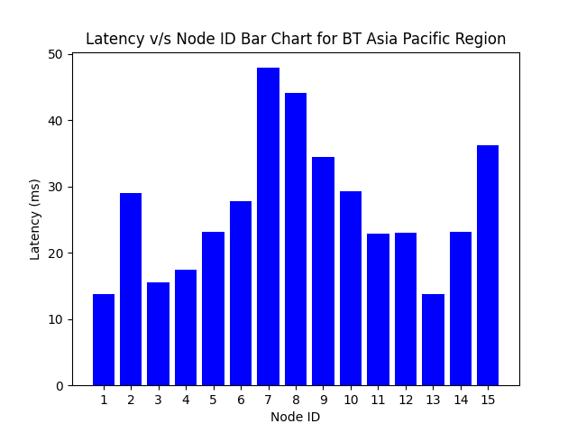
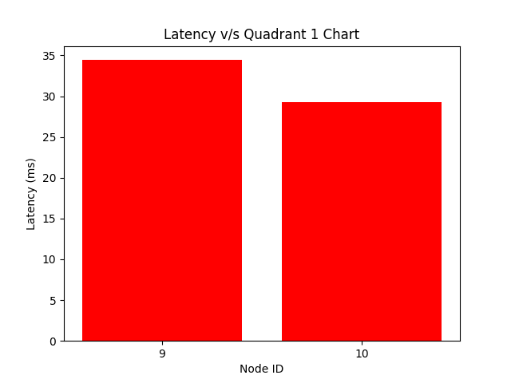
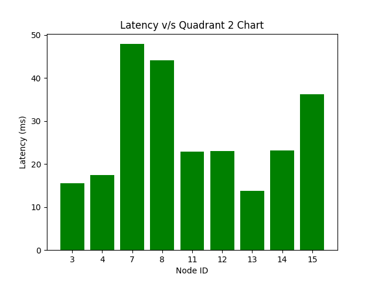
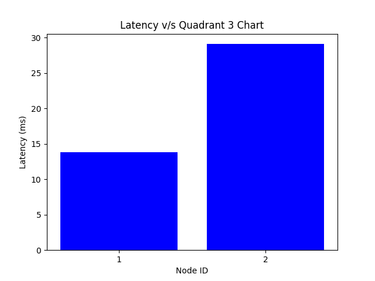
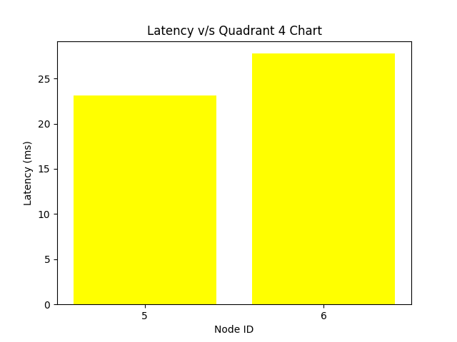
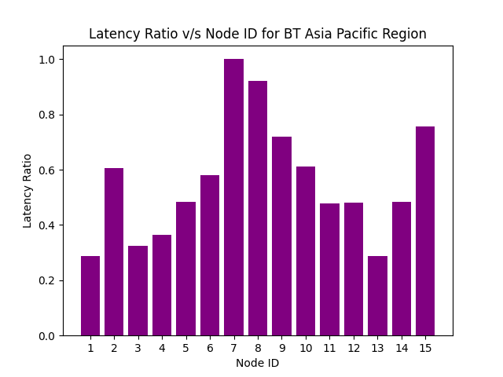
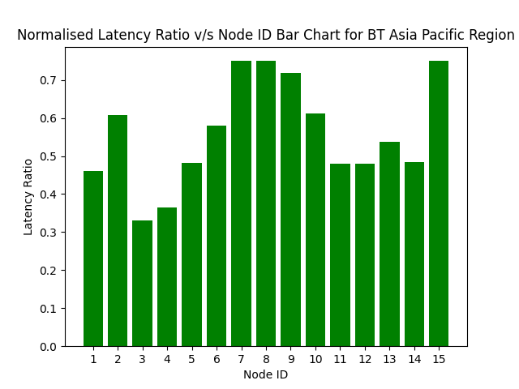

# IEEE Project on Global Connectivity Framework and 5G IoT Resource Sharing using Game Theory

## Objective

The objective of this project is to develop an effective solution that reduces network traffic at different nodes of a particular region and evenly redistributes the load, achieving uniform 5G network connectivity. This project aims to optimize network performance and resource allocation using game theory principles.

## Duration of Project

May 2022 - July 2022

## Project Components

### NodesScript.py

`NodesScript.py` is a Python script that serves as a key component of the project. It performs the following tasks:

1. **Calculate Latency (Delay) for Each Node**: The script calculates latency for each node based on the formula: Latency = 2 \* distance / speed. This latency calculation helps in understanding network delays.

2. **Plot Graph in Ascending Order**: It generates latency graphs in ascending order, allowing for a visual representation of network latency across nodes.

3. **Clustering Based on Four Quadrants**: The script clusters nodes based on four quadrants with a midpoint as the origin. This clustering helps in managing network resources effectively.

### Regions.py

`Regions.py` contains functions to define nodes, midpoint, and region name for different regions.

The dataset was derived from [http://www.topology-zoo.org/index.html](http://www.topology-zoo.org/index.html) which is a collection of network topologies. The dataset contains information about nodes, such as their names, countries, longitude, and latitude. The dataset is used to define nodes for different regions.

Here are the included regions:

#### BT Asia Pacific Region

This region includes nodes from various Asian and Oceanic countries, such as Indonesia, Australia, Singapore, Malaysia, and more. It provides detailed information about each node's country, longitude, and latitude.

#### Quest Region

The Quest region defines nodes based on data read from an external file. It includes nodes in the Quest network, specifying their countries, longitude, and latitude.

#### TATA Region

The TATA region defines nodes based on data read from an external file. It includes nodes in the TATA network, specifying their countries, longitude, and latitude.

#### ERNET Region

The ERNET region includes nodes in India, such as Pune, Indore, Trivandrum, Mumbai, and others. It provides detailed information about each node's country, longitude, and latitude.

#### PERN Region

The PERN region includes nodes in Pakistan, such as Peshawar, Karachi, Faisalabad, Quetta, Lahore, and others. It provides detailed information about each node's country, longitude, and latitude.

## Usage

To use the `NodesScript.py` script, follow these steps:

1. Run the script by executing the `main()`function in the script.
1. Choose a region (e.g., BT Asia-Pacific, Quest, TATA, ERNET, PERN) for analysis.
1. The script will calculate latency, generate latency graphs, cluster nodes into four quadrants, and provide load distribution analysis.
1. Graphs and visualizations are saved in the "Graphs" folder for further analysis and reference.

## Load Distribution

The script also analyzes load distribution among nodes. It calculates load limits for each node, generates load graphs, and provides load ratio analysis. Load distribution is optimized to ensure efficient resource utilization.

## Graphs

The script generates various graphs to visualize network latency, load distribution, and clustering:

